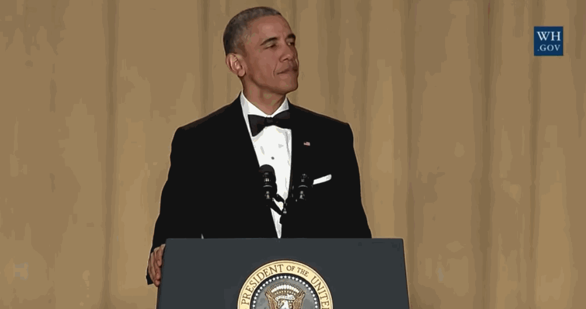

# 📲 peoples_scripts

> [!IMPORTANT]
> This repo is a living utility dump, not a curated finished toolkit.
> I use it to publish scripts that are useful to me across Termux and Linux, even when they still need cleanup or may not get immediate follow-up work.
> Expect uneven polish, uneven maintenance cadence, and occasional scripts that are more "practical snapshot" than stable release.

Cross‑platform Bash helpers that work on **Termux (Android)** and **Ubuntu/Linux**.  
All scripts auto‑detect the platform and write to the correct user folders via a shared helper: `~/.scripts/common.sh`.

for:
- Android 13 (Termux v0.118+)
- Ubuntu 22.04+
- STILL WORK IN PROGRESS | MOST SCRIPTS WILL NEED FURTHER TWEAKING
- THE SANDBOX_WIP FOLDER IS NOT PART OF THE INSTALL

## Project Status

- This repository is intentionally broad and a bit messy.
- Some scripts are daily-driver useful.
- Some scripts are experimental and may lag behind package or platform changes.
- I am happy to publish them anyway so the working pieces are available instead of sitting private on one machine.

If you need something production-grade, read each script before trusting it blindly.

---

## 📦 Included scripts

### `trans.sh`

Download **auto‑generated subtitles** from a video and save a clean transcript.
- Language: `-l en` (default) or `-l de`
- URL argument or **clipboard** fallback
- 5‑minute timestamps
- De‑only transliteration (using `iconv //TRANSLIT`)
- De‑dupes repeated lines  

**Saves to:** `Documents/Transcripts/<title>.txt`

**Usage**

```bash
trans.sh -l en "https://youtu.be/VIDEO"
# or
trans.sh -l de        # uses clipboard if URL is omitted
```

> **Termux Widget wrappers (optional):**

Place these tiny wrappers in `~/.shortcuts` to get EN/DE buttons:

- **trans-e.sh**
  ```bash
  #!/usr/bin/env bash
  exec "$HOME/scripts/trans.sh" -l en "$@"
  ```

- **trans-d.sh**
  ```bash
  #!/usr/bin/env bash
  exec "$HOME/scripts/trans.sh" -l de "$@"
  ```

Then, make them executable:
```bash
chmod +x ~/.shortcuts/trans-*.sh
```

---

### `art.sh`

Extracts readable article text (using Readability, Pandoc, Lynx, and a basic strip fallback).  
**Saves to:** `Documents/web_articles/<title>.txt`

**Usage**
```bash
art.sh "https://example.com/article"
# or, if URL is omitted, uses clipboard:
art.sh
```

---

### `music.sh`

Downloads albums/playlists/tracks via `yt-dlp`, converts to MP3, and embeds the thumbnail.  
**Saves to:** `Music/<playlist|uploader>/<title>.mp3`

**Usage**
```bash
music.sh "https://www.youtube.com/playlist?list=..."
```

---

### `stream.sh`

Records livestreams (e.g., YouTube) to MP4.  
**Saves to:** `Videos` (Ubuntu) or `Movies` (Termux/Android)

**Usage**
```bash
stream.sh "https://www.youtube.com/watch?v=LIVE_ID"
```

---

### `dl.sh`

A wrapper for `aria2c` for large downloads with sane defaults.  
**Saves to:** `Downloads/aria2c/`

**Usage**
```bash
dl.sh "https://big.example/file.iso" "https://mirror/file.iso"
```

---


## 🧰 Dependencies

You don’t have to install them manually—`setup.sh` handles it.  
It installs per‑platform packages and sets up the shared helper at `~/.scripts/common.sh`.

**Termux (Android)**
- python-yt-dlp
- ffmpeg
- aria2
- lynx
- pandoc
- nodejs
- termux-api
- jq
- (optional) readability-cli (installed via npm if npm is present)

**Ubuntu**
- yt-dlp
- ffmpeg
- aria2
- lynx
- pandoc
- xdg-user-dirs
- xclip
- wl-clipboard
- nodejs
- npm
- jq
- readability-cli (installed via npm)

---

## 🚀 Install

Clone the repository and run the setup:
```bash
git clone https://github.com/marx161-cmd/peoples_scripts.git
cd peoples_scripts
# Make scripts executable
chmod +x *.sh
./install.sh

# Advanced: You can still run setup.sh directly if you only want
# to install dependencies without copying scripts.
```

install.sh will add ~/scripts to your PATH automatically if it’s not already there.
If you prefer to do it manually, add the following line to your ~/.bashrc (and restart your shell):
```bash
export PATH="$HOME/scripts:$PATH"
```

For Termux storage bridge (first time only):
```bash
termux-setup-storage
```

---

## 🧪 Quick tests

Verify functionality with these commands:
```bash
# Verify helper, paths, and clipboard
bash test-common.sh

# Transcript (uses clipboard fallback if URL omitted)
trans.sh -l en

# Article saver
art.sh "https://en.wikipedia.org/wiki/Bash_(Unix_shell)"

# Music
music.sh "https://www.youtube.com/watch?v=dQw4w9WgXcQ"

# Livestream (when live)
stream.sh "https://www.youtube.com/watch?v=LIVE_ID"

# Large download
dl.sh "https://speed.hetzner.de/1GB.bin"
```

---

## 📂 Where Files Go (Auto‑Detected)

- **Documents:** `~/Documents` (Ubuntu) or `~/storage/shared/Documents` (Termux)
- **Pictures:** `~/Pictures` or `~/storage/shared/Pictures`
- **Music:** `~/Music` or `~/storage/shared/Music`
- **Videos:** `~/Videos` or `~/storage/shared/Movies`
- **Downloads:** `~/Downloads` or `~/storage/shared/Download`

_All paths are set in `~/.scripts/common.sh` and must not be hardcoded._

---

## ⚠️ Notes

- Clipboard on Termux requires the Termux:API app.
- On Wayland/X11 (Ubuntu), the clipboard uses `wl-paste` → `xclip` → `xsel` as fallback.
- `termux-setup-storage` may “rebuild links” — it never deletes your real files.

---

## 📜 License

Licensed under the [MIT License](LICENSE).
